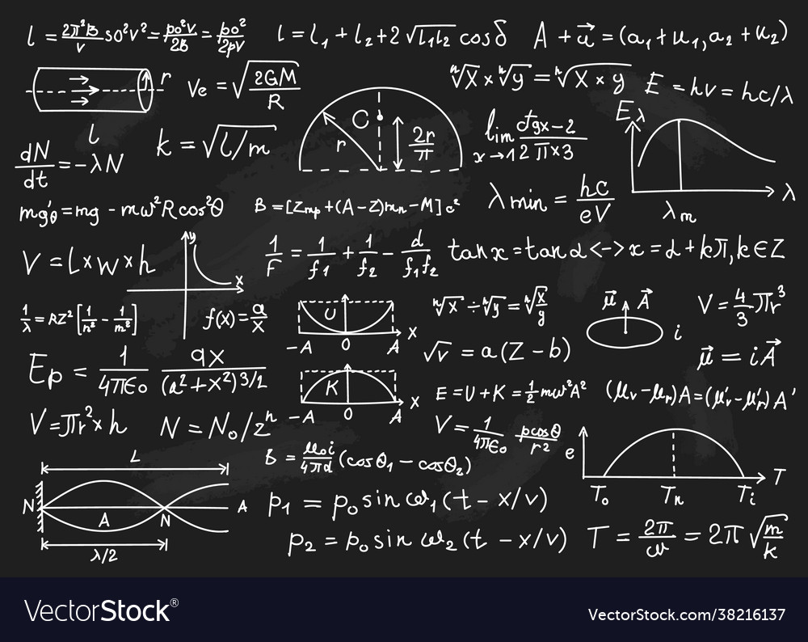

# Potential topics in Physics

  

What do you mean by potential topics, you might ask. Please read below to find out.

A couple of years ago, my long distance girlfriend at that time was studying for the University entrance exams when she asked me to teach her how to [compute the square root of decimal numbers](youtube.com/watch?v=v7AUT1TMxZM&t=8s). Instead of just sending her a video with my explanation, I decided to start a [channel on YouTube](https://www.youtube.com/channel/UCQJtnudYBb-nULKBjmkhTnw).

I made some other videos based on questions other friends asked me and some other random topics in Mathematics and Physics but I was always trying to think of a more sound way for choosing topics that would be really helpful to the students.

So, as a Brazilian physicist and knowing the difficulties and costs of high quality education in my country, I decided to build my first data analysis project with the intention to answer the following question:

**- Which topics/subtopics of Physics students in Brazil struggle the most?**

By answering this question I intend to be able to **select potential topics** and use this information to create new videos on my YouTube channel. 

Potential topics are those that are badly covered by youtubers, but searched often by students. By identifying a few of them  I can use this information to create videos for my youtube channel and contribute more effectively to the educational system of my home country.

## Strategy

There are two ways I can think of how to approach this project:

1 - Look in the ministery of education website and search for open source data.

This would be the best approach but, unfortunately, the brazilian government is currently (September 2022) remodeling all the data due to the lack of anonimity on the so far, open available data.

Given that, I will use a second approach:

2.1 - Use the ministery of education information to collect all mandatory topics in Physics pertaining the brazilian school curriculum.

2.2 - Use the YouTube API to search for these topics on YouTube.

2.3 - Identify popular subtopics for a given topic.

2.4 - Analyse the data and identify potential subtopics where a contribution would be valuable for students.

## Main mandatory areas (topics) in the Brazilian school curriculum

Physics is usually divided in four big areas in the Brazilian school curriculum. They are:

1. Mecanica (Mechanics),

2. Eletromagnetismo (Electromagnestism),

3. Termodinamica (Thermodynamics),

4. Otica (Optics).

The main topic out of these four is Mechanics with usually [up to 44% of the questions](https://infoenem.com.br/questoes-de-fisica-enem/) of the university entrance exams being about some of its subtopics.

Given the amount of content in each of the topics, this project will focus only on subtopics of Mechanics. The approach taken here can be easily extended to all other areas.

### Subtopics in Mechanics

Mechanics is a huge branch of physics and can be divided into two main subtopics:
  

- Cinematica (kinematics), which deals with theh description of movements without taking into considerantion what is causing it.
  

The list of **subtopics** in the Brazilian education high school curriculum is the following:

 1. Movimento e Repouso
 2. Movimento Uniforme 
 3. Movimento Uniformente variado 
 4. Lançamento vertical para cima 
 5. Queda livre 
 6. Vetores / Lançamento oblíquo 
 7. Lançamento horizontal  
 8. Cinemática vetorial 
 9. Movimento Circular 
 10. Estática de um ponto material
 11. Centro de massa e equilíbrio
 12. Estática do corpo extenso.

 

- Dinamica (dynamics), which explains the kinematic description by means of a fundamental cause (force of gravity, the presence of a spring, etc).
  

The list of **subtopics** for the dynamics is given by:
  

13. Leis de Newton
14. Forças tração, normal e peso
15. Força elástica 
16. Força de atrito 
17. Trabalho e energia 
18. Impulso e quantidade de movimento 
19. Lei de Kepler 
20. Lei de gravitação Universal 
21. Satélite em órbitas circulares 
22. Velocidade de escape 
23. Aceleração da gravidade.
  

Jupyter notebooks used to scrapped the data, explore, clean and analyse it can be found [here](https://github.com/RenatodaCostaSantos/Portfolio/tree/main/Challenging_Topics_Physics).

# Our goals

1. Are short videos watched more often than longer ones?
  
2. Which class of topics has more views? Hard, easy or moderate topics?
  
3. Which specific topics are worth investing on video production for my youtube channel?

# A guessing game

Before showing our analysis and conclusions let's take a minute to do some guessing about what we think we could expect given the available data.

Guessing the outcome has various benefits:

1. It forces us to use our intuition and think deeply about the problem we are investigating,

2. It can lead us to find some variables that could be engineered and improve the quality of our analysis,

3. It helps on the cleaning and exploration analysis before we start deriving conclusions,

4. It makes us critical of our results beforehand.

My guesses are:
  
**Guess for question 1:** Longer videos have **less views** than shorter ones.

While making videos for youtube I remember always becoming a bit anxious to force the length of the video to be under 8 minutes precisely because of this guess. My intuition is that students have a lack of attention in general and want to learn things fast.
  
**Guess for question 2:**  **Easy** topics will have, on average, more views than **hard** topics. However, I expect **hard** topics to be better covered than **easy** ones.

The first part of the answer would happen because of the struggles students face when start learning physics. They seem to get stuck right in the beginning.

Even though easy topics would have more views I expect to find a reasonable amount of easy topics that are not well covered.

I believe people that make videos for youtube intuitively think that hard topics should get more attention, which will lead to a higher number of successful videos for hard topics.

**Guess for question 3:** I can't think of a reasonable answer for this one. We will leave it to the data.

# Data analysis

A more precise and technical analysis and answers for the questions below can be found on the jupyter nootebooks here. 

We try to use a more intuitive, however less precise, approach below. 

## Are shorter videos watched more often than longer ones?

The graph below shows that, contrary to our guess, longer videos seems to have more views than shorter ones. 

Actually, the graph suggest that videos with time duration that fall into the 8 to 12 minutes or higher than 14 minutes are usually watched more often. 

This means no need to be anxious to keep the videos under 8 minutes when recording physics videos for youtube.

     

# Are easy topics watched more often than hard ones?

Even though a bar plot tend to loose a lot of information, it can give us an indication to the answer in this case. 

As we see below, easy and moderate topics have more views, on average, than hard ones. The first part of our guess seems to be correct. 

     

In our analysis, we defined the score of videos as the like to view ratio. A video with a number of likes closer to the number of views will have a high score. That's how we classify successful videos here.

In order to see if videos about easy topics have, on average, more successful videos than harder topics, we again make a bar plot.

     

